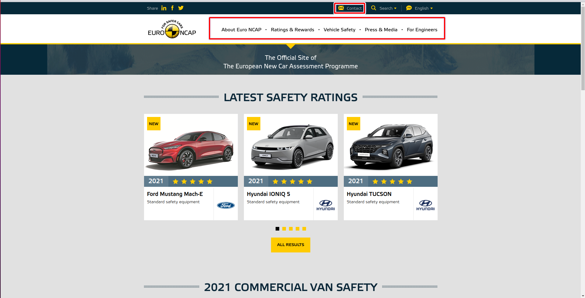
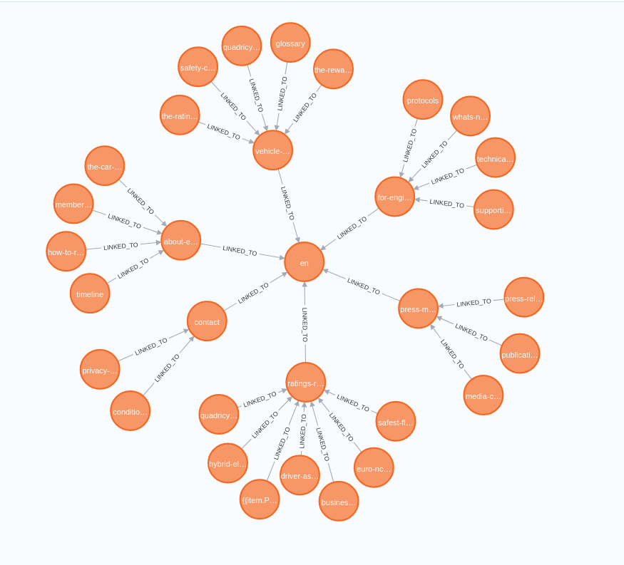
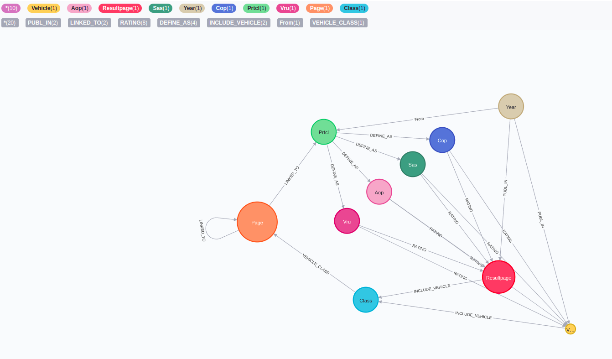
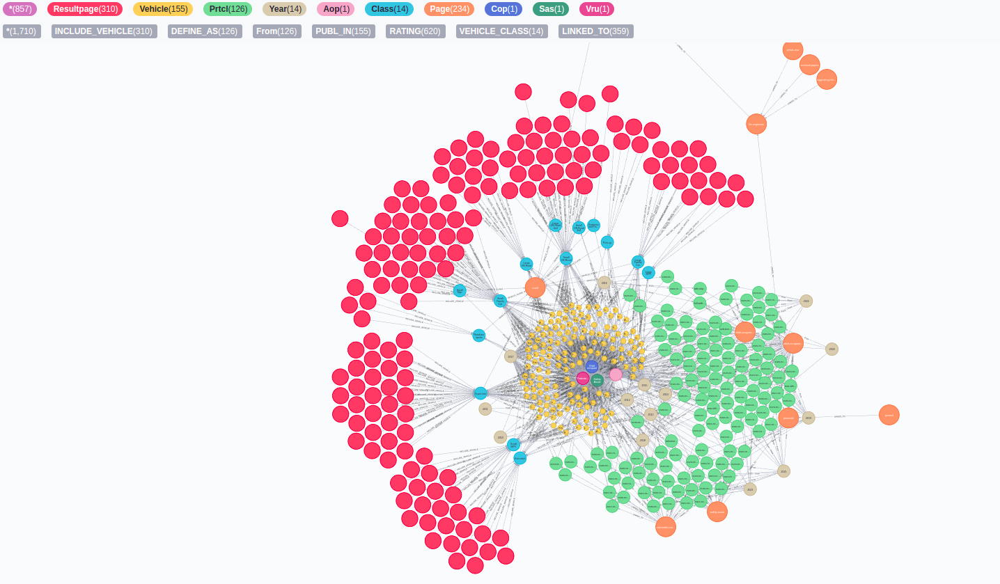

# Summary about the project

<!-- TABLE OF CONTENTS -->
<details>
  <summary>Table of Contents</summary>
  <ol>
    <li><a href="#about-the-project">About The Project</a></li>
    <li>
      <a href="#getting-started">Getting Started</a>
      <ul>
        <li><a href="#prerequisites">Prerequisites</a></li>
        <li><a href="#installation">Installation</a></li>
        <li><a href="#execution">Execution</a></li>
      </ul>
    </li>
    
  </ol>
</details>


<!-- ABOUT THE PROJECT -->
## About The Project
This project is about webscrapping the [EruoNcap website](https://www.euroncap.com/en/) into Neo4j graphically representing the flow of webpages with nodes and links. Later on it categorize the vehicle under the test based on the vehicle class and linked respectively with their corresponding years and prtcl. Ultimate aim is to Data model the EuroNcap.



The above image shows the Euroncap website (front page) whereas the subesquent webpages can be accessed through the following six options available at the current page that is marked with Red box.



The above image is the graphical representation of the Euroncap webpage in the Neo4j where the [main page](https://www.euroncap.com/en/)) is related to other six nodes with the relationship LINKED_TO which are [About Euro NCAP](https://www.euroncap.com/en/about-euro-ncap/), [Ratings&Rewards](https://www.euroncap.com/en/ratings-rewards/), [Vehicle Safety](https://www.euroncap.com/en/vehicle-safety/), [Press&Media](https://www.euroncap.com/en/press-media/), [For Engineers](https://www.euroncap.com/en/for-engineers/), [Contact](https://www.euroncap.com/en/contact/). These 6 nodes will have further subsequent pages that is also represented in the above image. The overall connection of the webpage is presented in the below image.


The other connection or nodes connected to the main page apart from the mentioned six nodes are the [results page](https://www.euroncap.com/en/results/ford/mustang-mach-e/43812) of various categories that are linked to the front page that is dispalyed when it is called.

Our ultimate vision for the Euro NCAP data modelling is to add semantics to them and develop an assistance benchmarking tool for the engineers, where the raw data can be extracted from the available test protocols and test results.

First, we look for semantics to compare the safety performance of vehicles. Such a comparison of vehicle performance is primarily conducted with vehicles from the same class, e.g.large family cars. We model a Vehicle node that represents a vehicle on the market. Thus, the class specification of the vehicle is stored as a Class node to ease querying vehicles from the same class. As can be seen, the available information per vehicle includes the protocol classifications for different EuroNCAP assessments, and the vehicle configuration, as showed in below schema. 




We include the vehicle specification table and test media, images, and video URL as Veh node properties. Furthermore, we model the four test subdisciplines of
Vulnerable Road User/pedestrian, Adult Occupant Protection, Child Occupant Protection, and Safety Assist with VRU , AOP , COP , and SA nodes, respectively, Figure 2. Ad-
ditionally, for each pair of subdiscipline and vehicle, the performance value of a vehicle is stored as the weight of a RATING edge. We can extract this information from
each tab of the result table. The specifications for subdisciplines may differ for each vehicle depending on the market release year of the vehicle. Therefore, we add a Year node connected to each Vehicle to identify the relevant protocols for each vehicle.

Generally, we aim to have a continuous data extraction and import from the Euro NCAP pages. To achieve that, we additionally store data about the webpage, where Page refers
to each page as a node in the database, and page connectivity, reveals the webpage’s structure and its LINKED TO content. The URLs of protocols available on the Euro NCAP
pages are structured based on the year and the subdiscipline. We use this structure to generate an additional node Prtcl for each protocol URL and connect the protocol PDF to its year DEFINED AS and subdiscipline with.





<p align="right">(<a href="#top">back to top</a>)</p>


<!-- GETTING STARTED -->
## Getting Started

The project is model in a Django Framework so that it can be published in webpages/app

### Prerequisites

* Django
* Django_neomodel
* Python > 3.5
* Neo4j > 4.2

<p align="right">(<a href="#top">back to top</a>)</p>

### Installation

* Django and Django_neomodel installation refer the [Django tutorial](https://gitlab.scai.fraunhofer.de/ndv/research/automotive/cae_web/-/blob/ganesh/documents/new/Django.pdf)
* Neo4j instatllation refer [Neo4j tutorial](https://gitlab.scai.fraunhofer.de/ndv/research/automotive/cae_nlp/-/blob/master/documents/Neo4j.pdf)

<p align="right">(<a href="#top">back to top</a>)</p>

### Execution

After creating a Django project followed by application, update models.py in myapp, then run the feedthekg.py

```bash
   python feedthekg.py
```

PS: Update Neo4j credentials of yours to execute.

<p align="right">(<a href="#top">back to top</a>)</p>


