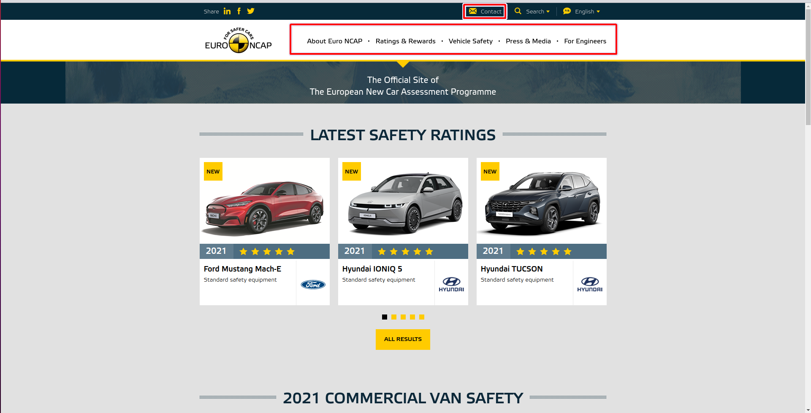
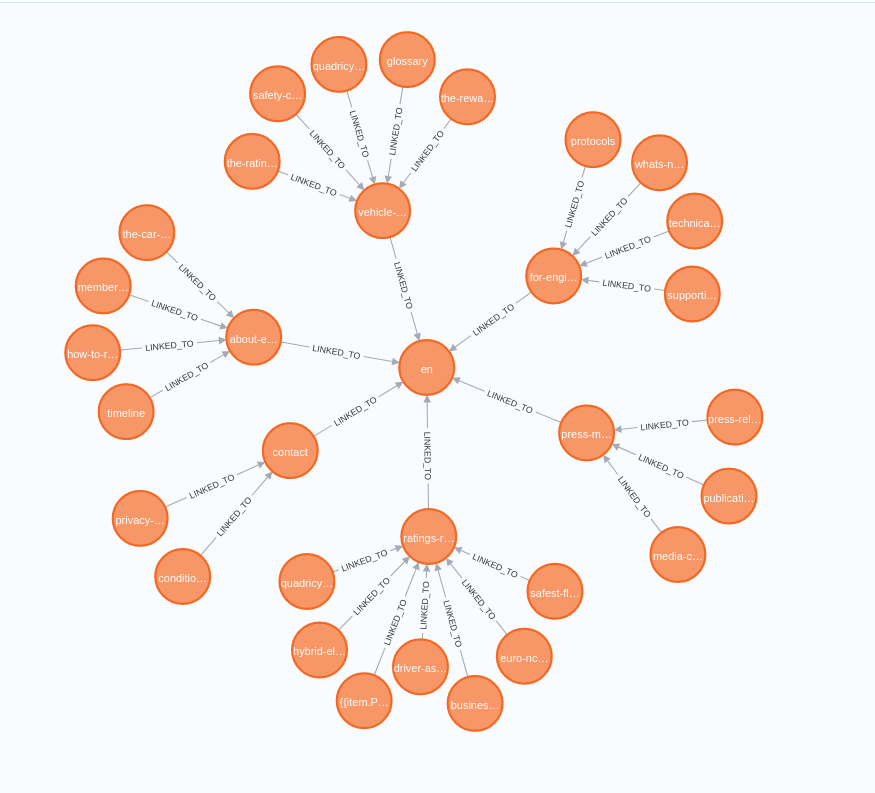
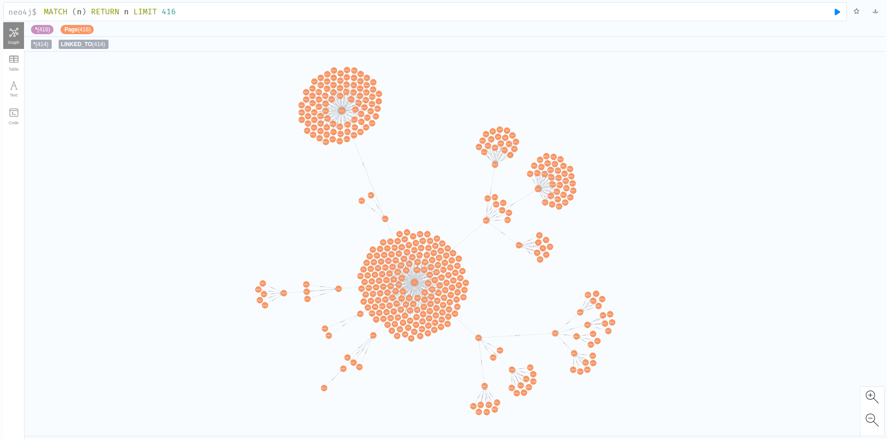
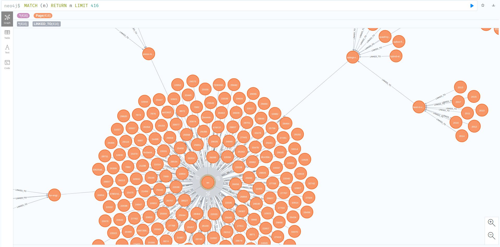

# Summary about the project

<!-- TABLE OF CONTENTS -->
<details>
  <summary>Table of Contents</summary>
  <ol>
    <li><a href="#about-the-project">About The Project</a></li>
    <li>
      <a href="#getting-started">Getting Started</a>
      <ul>
        <li><a href="#prerequisites">Prerequisites</a></li>
        <li><a href="#installation">Installation</a></li>
        <li><a href="#execution">Execution</a></li>
      </ul>
    </li>
    
  </ol>
</details>


<!-- ABOUT THE PROJECT -->
## About The Project
This project is about webscrapping the [EruoNcap website](https://www.euroncap.com/en/) into Neo4j graphically representing the flow of webpages with nodes and links.



The above image shows the Euroncap website (front page) whereas the subesquent webpages can be accessed through the following six options available at the current page that is marked with Red box.



The above image is the graphical representation of the Euroncap webpage in the Neo4j where the [main page](https://www.euroncap.com/en/)) is related to other six nodes with the relationship LINKED_TO which are [About Euro NCAP](https://www.euroncap.com/en/about-euro-ncap/), [Ratings&Rewards](https://www.euroncap.com/en/ratings-rewards/), [Vehicle Safety](https://www.euroncap.com/en/vehicle-safety/), [Press&Media](https://www.euroncap.com/en/press-media/), [For Engineers](https://www.euroncap.com/en/for-engineers/), [Contact](https://www.euroncap.com/en/contact/). These 6 nodes will have further subsequent pages that is also represented in the above image. The overall connection of the webpage is presented in the below image.




The other connection or nodes connected to the main page apart from the mentioned six nodes are the [results page](https://www.euroncap.com/en/results/ford/mustang-mach-e/43812) of various categories that are linked to the front page that is dispalyed when it is called.

<p align="right">(<a href="#top">back to top</a>)</p>


<!-- GETTING STARTED -->
## Getting Started

The project is model in a Django Framework so that it can be published in webpages/app

### Prerequisites

* Django
* Django_neomodel
* Python > 3.5
* Neo4j > 4.2

<p align="right">(<a href="#top">back to top</a>)</p>

### Installation

* Django and Django_neomodel installation refer the [Django tutorial](https://gitlab.scai.fraunhofer.de/ndv/research/automotive/cae_web/-/blob/ganesh/documents/new/Django.pdf)
* Neo4j instatllation refer [Neo4j tutorial](https://gitlab.scai.fraunhofer.de/ndv/research/automotive/cae_nlp/-/blob/master/documents/Neo4j.pdf)

<p align="right">(<a href="#top">back to top</a>)</p>

### Execution

After creating a Django project followed by application, update models.py in myapp, then run the feedthekg.py

```bash
   python feedthekg.py
```

PS: Update Neo4j credentials of yours to execute.

<p align="right">(<a href="#top">back to top</a>)</p>


